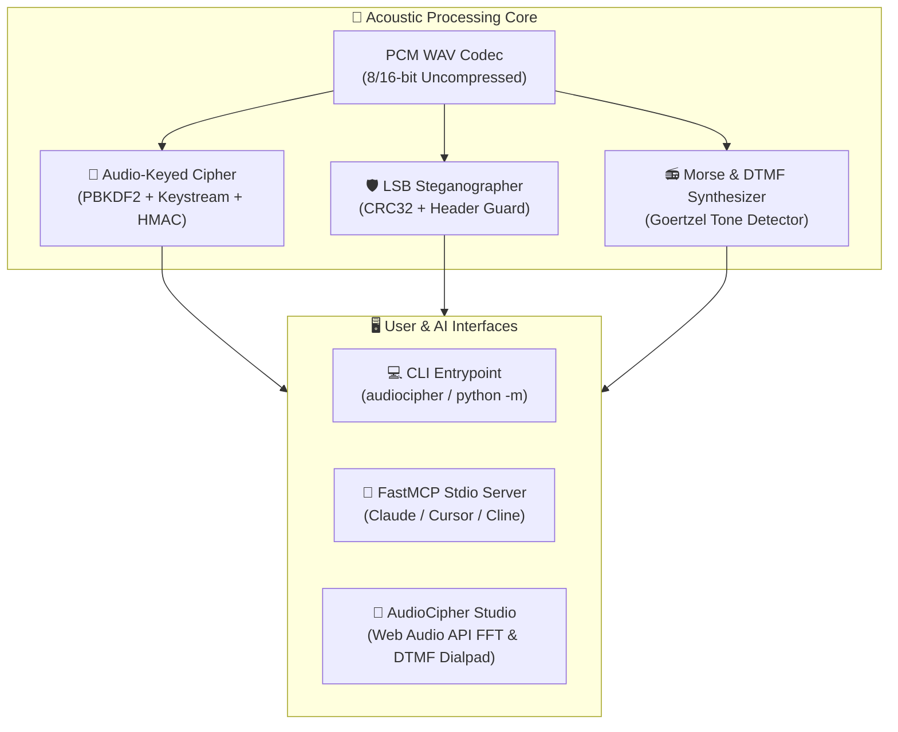

# 🔒 AudioCipher Stego Engine

[](https://github.com/1nc0gn30/audiocipher-stego-engine/actions)
[](https://www.python.org/downloads/)
[](https://github.com/1nc0gn30/audiocipher-stego-engine)
[](https://modelcontextprotocol.io/)
[](https://opensource.org/licenses/MIT)

> **Audio-Keyed Authenticated Cryptography, PCM Audio Steganography & Morse Spectrogram Synthesizer with Material 3 Web UI, Multi-OS CLI, FastMCP stdio server, and zero external runtime dependencies.**

---

## ✨ Features

- 🔒 **Audio-Keyed Authenticated Encryption**: Derives 256-bit cryptographic keys using PBKDF2-HMAC-SHA256 from raw acoustic waveforms and precise decibel/volume modifiers. Encrypts payloads using authenticated keystream cipher + HMAC-SHA256 integrity tags.
- 🛡️ **PCM Audio Steganography**: Embeds secret files and strings into the least significant bits (LSB) of uncompressed 16-bit PCM WAV audio carriers with CRC32 integrity checksum validation and magic header verification.
- 📻 **Acoustic Morse Code & Spectrogram Synthesizer**: Converts text messages into audible Morse code tone sequences and multi-frequency spectrogram visual patterns at configurable speed (WPM) and frequency (Hz).
- 🎨 **AudioCipher Studio Web UI**: Real-time Web Audio API oscilloscope visualizer, interactive audio cipher ritual runner, drag-and-drop stego carrier injector, and 1-click WAV export (design influenced by Material 3 tokens).
- ⚡ **Zero Third-Party Runtime Dependencies**: 100% Python Standard Library runtime (`wave`, `struct`, `hashlib`, `hmac`, `math`, `zlib`, `http.server`, `urllib`, `argparse`).
- 🤖 **FastMCP Server Protocol**: Full Model Context Protocol (MCP) JSON-RPC 2.0 stdio server for Claude Desktop, Cursor, Cline, and autonomous AI agents.

---

## 🚀 Quick Start

### Installation
```bash
# Clone the repository
git clone https://github.com/1nc0gn30/audiocipher-stego-engine.git
cd audiocipher-stego-engine

# Install in editable mode
pip install -e .
```

---

## 💻 CLI Usage

```bash
# Encrypt message using an audio file as key with 50 dB modifier
audiocipher encrypt "Sovereign Agent Directive #757" -k secret_track.wav --volume 50.0 -o encrypted.bin

# Decrypt payload using the exact audio key and volume level
audiocipher decrypt encrypted.bin -k secret_track.wav --volume 50.0 -o decrypted.txt

# Embed secret payload into a WAV audio carrier via LSB steganography
audiocipher embed secret_notes.txt -c carrier.wav -o stego.wav

# Extract hidden payload from steganographic WAV carrier
audiocipher extract stego.wav -o recovered_secret.txt

# Synthesize Morse code audio WAV from plaintext message
audiocipher morse "SOS SOVEREIGN AGENT 757" --freq 800 --wpm 20 -o morse.wav

# Launch AudioCipher Studio Web UI (Material 3 influenced)
audiocipher serve --port 8096

# Start FastMCP stdio server for LLM agents
audiocipher mcp

# Run system diagnostics
audiocipher doctor
```

---

## 🤖 Model Context Protocol (MCP) Setup

Add `audiocipher-stego-engine` to your Claude Desktop or Cursor configuration:

```json
{
  "mcpServers": {
    "audiocipher": {
      "command": "python3",
      "args": ["-m", "audiocipher_stego_engine", "mcp"]
    }
  }
}
```

### Registered MCP Tools:
- `audio_encrypt`: Encrypt payload data using audio file bytes and decibel modifier.
- `audio_decrypt`: Decrypt payload data using audio file bytes and decibel modifier.
- `audio_stego_embed`: Hide payload inside a WAV carrier using LSB steganography.
- `audio_stego_extract`: Extract hidden payload from a WAV carrier.
- `audio_morse_synthesize`: Generate a synthesized Morse code WAV audio buffer from plaintext.
- `audio_diagnostics`: Platform and toolchain health check.

---

## 📐 Mathematical Foundations

### 1. Audio-Keyed Key Derivation (PBKDF2-HMAC-SHA256)
Acoustic waveforms serve as high-entropy sources for key derivation. Given raw PCM audio bytes $A$ and volume threshold $V_{\text{dB}}$:

$$\text{Salt} = \text{SHA-256}(A \parallel \text{IEEE-754}(V_{\text{dB}}))$$
$$\text{Key} = \text{PBKDF2}(\text{HMAC-SHA256}, \text{password}=A, \text{salt}=\text{Salt}, \text{iterations}=100{,}000, \text{keylen}=32)$$

### 2. Dual-Tone Multi-Frequency (DTMF) & Goertzel Algorithm
DTMF encodes keypad symbols as simultaneous pairs of sinusoidal tones (one low group frequency $f_L \in \{697, 770, 852, 941\}\,\text{Hz}$ and one high group frequency $f_H \in \{1209, 1336, 1477, 1633\}\,\text{Hz}$):

$$x[n] = A_1 \sin(2\pi f_L n / f_s) + A_2 \sin(2\pi f_H n / f_s)$$

To detect tones without full $O(N \log N)$ FFT overhead, the Goertzel algorithm operates in $O(N)$ with recurrence:

$$s_k[n] = x[n] + 2\cos\left(\frac{2\pi k}{N}\right) s_k[n-1] - s_k[n-2]$$

where spectral energy power is extracted after $N$ samples:

$$P_k = s_k^2[N] + s_k^2[N-1] - 2\cos\left(\frac{2\pi k}{N}\right) s_k[N] s_k[N-1]$$

### 3. LSB Steganography Carrier Frame Structure
PCM audio samples encode payload bits into the least significant bit of each 16-bit audio channel:

```
+------------------+---------------------+-------------------+------------------+
| Magic (8 Bytes)  | Length (4 Bytes BE) | Payload (N Bytes) | CRC32 (4 Bytes)  |
| "AUDSTG01"       | uint32_t            | Raw bytes         | IEEE 802.3       |
+------------------+---------------------+-------------------+------------------+
```

---

## 🏛️ Architecture



---

## 🐍 Python SDK API Reference

```python
from audiocipher_stego_engine.crypto_core import derive_audio_key, encrypt_payload, decrypt_payload
from audiocipher_stego_engine.spectrogram import synthesize_dtmf_audio, decode_dtmf_audio, synthesize_morse_audio
from audiocipher_stego_engine.stego_engine import StegoEngine
from audiocipher_stego_engine.wav_codec import AudioBuffer

# 1. Synthesize and decode DTMF phone key sequence
dtmf_audio = synthesize_dtmf_audio("8675309#")
decoded_digits = decode_dtmf_audio(dtmf_audio)
print(f"Decoded DTMF: {decoded_digits}")  # "8675309#"

# 2. Hide secret data in a carrier WAV
carrier = AudioBuffer.generate_carrier_chord([440.0, 554.37, 659.25], duration=2.0)
stego_audio = StegoEngine.embed_lsb(carrier, b"CLASSIFIED_PAYLOAD_99")
recovered = StegoEngine.extract_lsb(stego_audio)
print(f"Recovered: {recovered.decode('utf-8')}")

# 3. Acoustic-keyed authenticated encryption
tone = AudioBuffer.generate_sine_tone(440.0, 1.0)
key, salt = derive_audio_key(tone.to_wav_bytes(), volume_db=50.0)
ciphertext = encrypt_payload(b"Agent Directive", key, salt)
```

---

## 🧪 Running Tests

```bash
pytest -v
```

---

## 📜 License

MIT License © 2026 1nc0gn30

